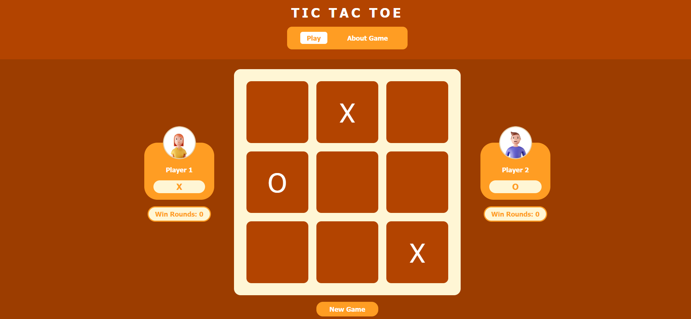

<h1 align="center">Simple Tic-Tac-Toe Game</h1>
<h2 align="center">Hands-On Task 1</h2>
<h2 align="center"> Sister in Tech FE Engineering </h2>

<p align="center">
  
</p>

## Content
- [Description](#description)
- [Project Structure](#project-structure)
- [Requirements and How to Run](#requirements-and-how-to-run)
- [Author](#author)

## Description
This is a simple Tic-Tac-Toe game built using HTML, CSS, and JavaScript, designed to run locally in any modern web browser. The game allows two players to take turns marking spaces on a 3x3 grid, with one player using "X" and the other using "O". The objective is to be the first to align three of your marks horizontally, vertically, or diagonally. If all cells are filled without either player achieving this, the game ends in a draw.

## Project Structure
```
TicTacToe
├── doc/                        # Folder for storing image assets used in the game
│   ├── player1.png
│   ├── player2.png
│   └── tictactoe.png             
├── src/                        # Main folder containing the source code of the application
│   ├── about.css               # CSS file for styling the About page
│   ├── about.html              # About page with information about the game
│   ├── main.html               # Main game page where the Tic-Tac-Toe is played
│   ├── script.js               # JavaScript file containing the game logic
│   └── style.css               # Main CSS file for styling the game interface
└── README.md                  # Main documentation file with a project overview, how to run, and other details
```

## Requirements and How to Run

1. Clone the repository:
   ```
    git clone https://github.com/mineraleee/TicTacToe
   ```
2. Open the project foler:
   ```
    cd TicTacToe
   ```
3. Navigate to the src directory:
   ```
    cd src
   ```
4. No additional setup or installation is required, just open the main.html file in your browser to start playing:
   ```
    main.html
   ```

## Author
<table>
  <tr>
    <td align="center">
      <a href="https://github.com/mineraleee">
        <br />
        <span><b>Heleni Gratia</b></span>
      </a>
    </td>
  </tr>
</table>

<div>
  <strong>Sister in Tech FE Engineering</strong><br>
  <em>Simple Tic-Tac-Toe Game</em>
</div>